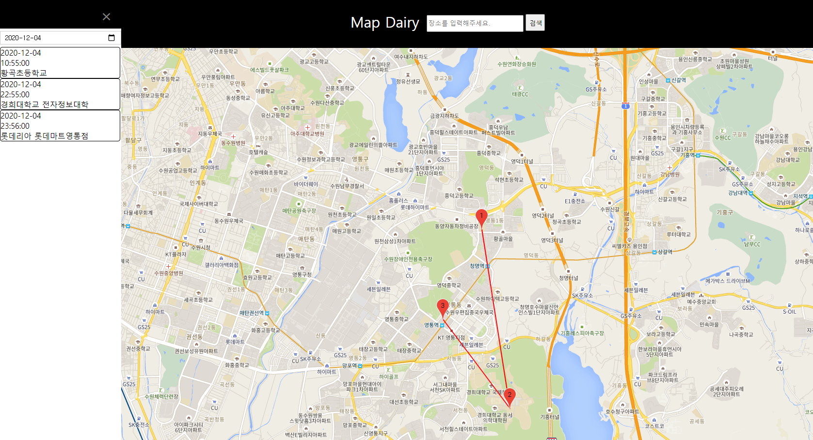

# googleMap diary
## google maps api,google places api를 이용한 일기페이지
</img><br/>

## 1. 프로젝트 계획이유
```
어느 날 일기를 작성하다가 문득 "백지에 작성하는 일기보다 지도를 이용하면 더 쉽게 장소별 세부내용을 적을 수 있지 않을까?"라는 생각에 제작해보게 되었습니다.
```
## 2. 프로젝트 구성
### 2-1. 주요기능
* 회원별 정보 저장을 위한 로그인 (w3schools의 로그인 페이지를 참고하였습니다.)
* 회원가입 (w3schools의 회원가입 페이지를 참고하였습니다.)
* 장소 검색, 자동완성
* 장소 일기 작성, 저장
* 날짜별 작성한 일기 검색, 수정, 삭제

### 2-2. 사용 방법
1. 자신의 정보 저장을 위한 회원가입, 로그인
2. 화면 상단 검색창에 장소 검색
3. 지도에 찍힌 마크 클릭 후 일기 작성, 저장
4. 화면 좌측 상단의 open을 누르고 날짜를 선택해 작성한 일기 조회
5. 일기 조회시, 지도에 찍힌 마크를 눌러 일기 수정, 삭제

### 2-3. 개발 환경
+ node.js - v14.15.0
+ npm - v6.14.8
+ Express - 4.17.1
+ EJS
+ Google Chrome


### 2-4. API List
+ Google maps API
+ Google Places API

<br/>

</img><br/>

<br/>

## 3. 빌드방법
### 3-1. Api Key 발급
+ https://cloud.google.com/maps-platform/ 에서 google maps API와 google Places API 발급

### 3-2. git clone
git clone 해주세요
```
git clone https://github.com/kyungcom/MapDairy.git
```
### 3-3. npm install
```
npm install
```

### 3-4. .env 파일 설정
.env 파일을 만들고
```
COOKIE_SECRET=?
SQL_ID=?
SQL_PWD=?
DATABASE=?
PLACES_API_KEY=?
```
? 값을 채워주세요 DATABASE에는 SCHEMA이름을, PLACES_API_KEY에는 발급받은 google places API key를 넣어주시면 됩니다.

### 3-5. views/main.ejs , views/layout.ejs 에 google maps API KEY 넣기
발급받은 google maps API key를 layout.ejs의 36번째 줄, main.ejs 183번째 줄에 넣어주세요
```
  <script async defer src="https://maps.googleapis.com/maps/api/js?key=여기에 넣어주세요&callback=initMap&region=kr"></script>
```

### 3-6. mysql 설정
mysql접속 후 
1. 스키마 생성
```
CREATE SCHEMA 사용하고싶은 schema 이름;
```
2. 테이블 생성
아래 3개 명령어를 하나씩 입력해주세요

```
use 위에서 생성한 schema 이름;
```

```
CREATE TABLE nodejs.users(
    id INT NOT NULL AUTO_INCREMENT,
    userid VARCHAR(30) NOT NULL,
    password VARCHAR(30) NOT NULL,
    PRIMARY KEY(id))
    COMMENT='사용자 정보'
    DEFAULT CHARSET=utf8
    ENGINE=InnoDB;
```
```
CREATE TABLE nodejs.diary(
    id INT NOT NULL AUTO_INCREMENT,
    userid VARCHAR(30) NOT NULL,
    placename VARCHAR(30) NOT NULL,
    date DATE NOT NULL,
    time TIME NOT NULL,
    text VARCHAR(2000) NOT NULL,
    lat VARCHAR(20) NOT NULL,
    lng VARCHAR(20) NOT NULL,
    PRIMARY KEY(id))
    COMMENT='일기 정보'
    DEFAULT CHARSET=utf8
    ENGINE=InnoDB;
```
모두 끝났습니다!
app.js를 실행한 후,
http://localhost:3000/ 으로 접속하면 이용가능합니다!

## License
````````
The MIT License

Copyright (c) 2020 ParkInho

Permission is hereby granted, free of charge, to any person obtaining a copy
of this software and associated documentation files (the "Software"), to deal
in the Software without restriction, including without limitation the rights
to use, copy, modify, merge, publish, distribute, sublicense, and/or sell
copies of the Software, and to permit persons to whom the Software is
furnished to do so, subject to the following conditions:

The above copyright notice and this permission notice shall be included in
all copies or substantial portions of the Software.

THE SOFTWARE IS PROVIDED "AS IS", WITHOUT WARRANTY OF ANY KIND, EXPRESS OR
IMPLIED, INCLUDING BUT NOT LIMITED TO THE WARRANTIES OF MERCHANTABILITY,
FITNESS FOR A PARTICULAR PURPOSE AND NONINFRINGEMENT. IN NO EVENT SHALL THE
AUTHORS OR COPYRIGHT HOLDERS BE LIABLE FOR ANY CLAIM, DAMAGES OR OTHER
LIABILITY, WHETHER IN AN ACTION OF CONTRACT, TORT OR OTHERWISE, ARISING FROM,
OUT OF OR IN CONNECTION WITH THE SOFTWARE OR THE USE OR OTHER DEALINGS IN
THE SOFTWARE.
``````````
